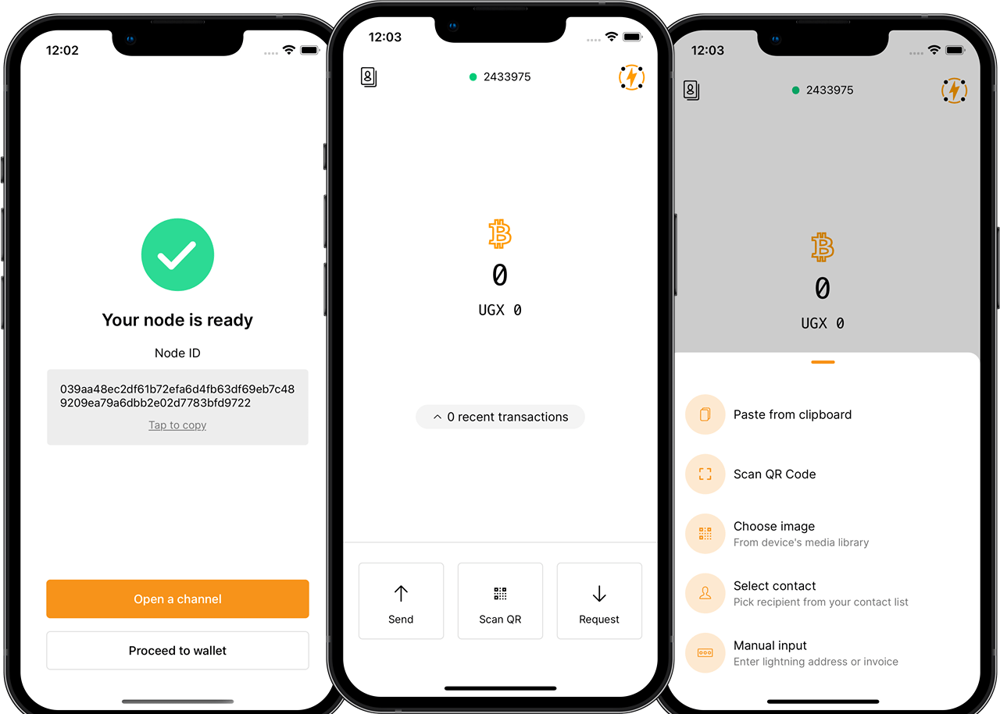

# Etta: A reference open-source non-custodial lightning wallet



- Built with React Native for Android & iOS.
- Written in Typescript
- Fully customizable with designed components
- Built with accessibility in mind ♿️
- Built-in localization 💬
- Open source 😸


[](https://twitter.com/EttaWallet)
[](https://github.com/EttaWallet/EttaWallet/stargazers)

Etta Wallet will be a resource for experimenting with non-custodial lightning with a strong bias towards usability, accessibility and good UX.

The project is strongly inspired by [Bitcoin Design Community's daily spending wallet](https://bitcoin.design/guide/daily-spending-wallet/) and will continue to evolve with their sound suggestions.

## Features

- [x] Bitcoin only wallet
- [x] Non-custodial
- [x] Lightning via LDK and Electrum
- [x] Supports multiple languages and locales
- [x] Accessibility baked-in (Haptic feedback, screen reader support)
- [x] Biometrics security: Fingerprint, Touch ID, FaceID
- [x] Scan QR codes
- [x] Just-In-Time liquidity with zero-conf channels
- [x] Open new channels
- [x] Automated channel creation via LSP
- [x] Local backups
- [ ] Cloud backups
- [ ] Connect over TOR
- [x] LNURL support
- [x] Contacts (For BOLT 12 offers, Lightning addresses, etc)
- [ ] Toggle dark mode

## Current Limitations

- Ships in testnet for now
- Translations are outdated.
- Accessibility features are outdated for most components.

## Test with us

EttaWallet is still in beta and only works on testnet for now but it would be nice to have more people test the recent release. You can find links for Android and IOS below. You need to have TestFlight on IOS:

<a href="https://testflight.apple.com/join/vZaHZIi4"></a>  <a href="https://play.google.com/store/apps/details?id=com.ettaln"></a>

## Reproducible Build (**Don't trust, verify**)

> **Note**
Please make sure have set up your development environment properly. [Here is a good guide](https://reactnative.dev/docs/environment-setup?guide=native) but here's the TLDR:

1. Install [node.js LTS version(>= 16)](https://nodejs.org/en/)
2. Install [yarn package management tool](https://yarnpkg.com/)
3. To build the IOS app, make sure you have XCode installed and the version is greater than or equal to 13.3
4. To build the Android app, make sure that the local JDK version is greater than or equal to 11 and the path to JDK is set in bash.

Start by [forking the repo](https://github.com/EttaWallet/EttaWallet/fork) from GitHub, clone it locally and install dependencies, like so:

```bash
git clone https://github.com/YOUR_GITHUB_USERNAME/EttaWallet
cd EttaWallet
yarn install
```

Once you've cloned the repo, installed dependencies, run the following command.

```bash
yarn start
```

### Android

1. Using a physical android phone? Enable Developer mode and USB Debugging, and confirm it is connected by running `adb devices`. If you want to use an Android simulator, this step isn't necessary
2. Open a new tab in your terminal and run `yarn android`

### iOS

1. Open a new tab in your terminal and run `yarn ios`.

### Common issues

1. The app does not build or start

For any missing environment variables, module and dependency issues in the build phase, it is recommended to use the command `yarn clean` in the root directory first. The command will clear all sub-dependencies, as well as the module cache of yarn, the cache of tools such as metro / babel, and then restart the project to try.

2. CocoaPods related errors

This might happen while installing Pods for the IOS App. You can run `yarn clean` which will deintegrate the existing Pods and attempt to reinstall. In the `./postinstall.js` script, the Pods are configured to install for M1 architecture. If you are using an older mac, you can simply remove edit `./postinstall.js` and uncomment the first line in `function postInstallMac()` but remember to comment the next few lines for M1 though. After that, you can run `yarn clean` again.

3. This project has only been developed on macOS and no testing has been done (yet) on other operating systems. If you encounter issues on Windows, I suggest you try using a unix-like environment like WSL. 

## Contributing

EttaWallet is an open-source project so anybody can use and contribute to it. You also don't necessarily need to know how to code. Some meaningful contributions include:

- Sharing ideas and suggestions
- Improving documentation
- Sharing well-written bug reports
- Improving the translation scope.
- Requesting new features.

You can start in the [discussion forum here](https://github.com/orgs/EttaWallet/discussions).

If you would like to contribute code, here a few guidelines:

- It would be helpful to create an issue first before submitting a PR just to make sure nobody isn't working on the same yet or it just wouldn't be a good fit.
- Even if your changes are obvious, your PR should define what you are changing. Nothing is too obvious.
- PRs should be opened against the `next` branch.

### Branches

`current` - The latest release

`next` - The branch to submit pull requests against. It mirrors what's coming in the next release

## License

EttaWallet is 100% open-source and available under the MIT license.

## Attribution

Special thanks to the following open-source projects that help make EttaWallet possible.

- All design tokens and primitives are inspired by [Bitcoin Design Guide](https://bicoin.design/)'s daily spending wallet
- Icons are courtesy of [Bitcoin Icons](https://bitcoinicons.com)
- Non-custodial lightning is courtesy of [Lightning Dev Kit(LDK)](https://lightningdevkit.org) and made possible through Synonym's [react-native-ldk](https://github.com/synonymdev/react-native-ldk)
  